## Using Jupyter Notebooks

[Jupyter Notebooks](https://jupyter.org/) are open-source web applications that allow you to create and share documents that contain live code, equations, visualizations, and explanatory text. You can utilize a Jupyter Notebook to access functions not available in the ContraxSuite UI, to either pull data from ContraxSuite or modify existing code.

This guide is intended to help Technical Admins use Jupyter Notebooks within ContraxSuite. This is a supplement to help work with an existing notebook - this is _not_ a guide on how to write notebooks from scratch, nor is it a tutorial on [Python](https://www.python.org/).

> **WARNING:** Jupyter Notebooks can significantly alter data and system configuration. They can be a very formidable tool, but also have the potential to create unintended consequences. Access to Jupyter Notebooks should be limited to very specific users, and caution should always be taken when utilizing Notebooks.

---

#### Tips for Using Jupyter Notebooks

Sometimes running the code in a particular cell can result in a timeout if it sits for a long time. If this happens, select Kernel **>** Restart. This will refresh the connection so the code can run.

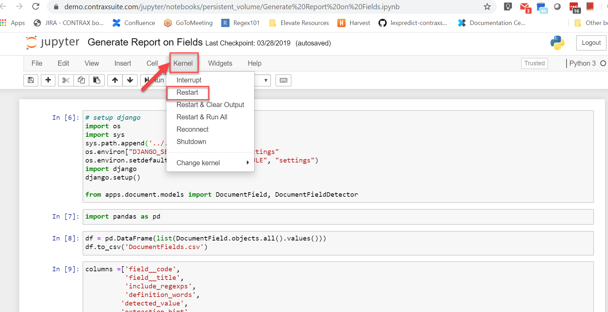

To run a notebook, click on the top cell, then click "Run", then click on the next cell and click "Run", and so on until there is an error or you get your desired output. Stop if you get errors and don't know why you are getting errors (other than the timeout error specified above, in which case you can just restart the Kernel).

---

#### How to Deploy Jupyter Notebooks in ContraxSuite

**1.** Access Jupyter for ContraxSuite at `[Your Contraxsuite URL]/jupyter`

**2.** To log in, you will first be prompted for a username and password. You will need to use the Administrator username and password for the system instance you're accessing.

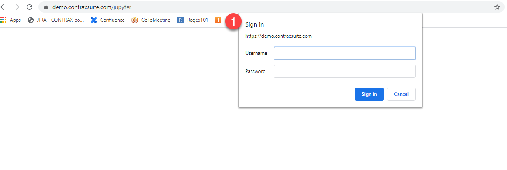
  
**3.** You will then be prompted to put in just a password on the Jupyter page. This login is likely "Administrator", or the same Administrator password used in the previous prompt.

**4.** ContraxSuite packages and deploys a set of out-of-the-box Jupyter Notebooks. You will find 1-2 folders deployed within the notebook. **Do not put any new files in the root location or the demo location** (if there is one). **ALL FILES YOU WANT TO KEEP MUST GO IN THE `persistent_volume` DIRECTORY**.

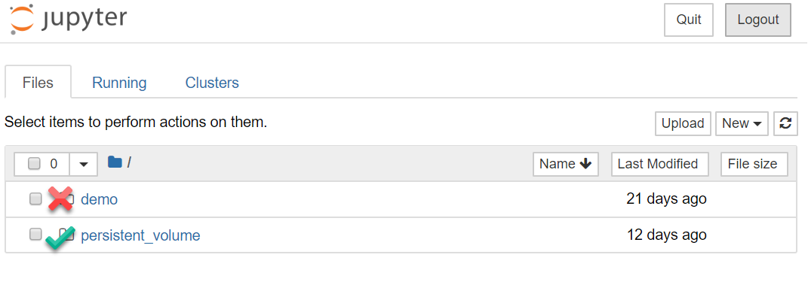

---

As an administrator of ContraxSuite, Jupyter Notebooks may be shared with you from our team, or from data scientists on your internal team. You will need to upload your Jupyter Notebook files onto your instance of ContraxSuite. Transfer your Jupyter Notebook files first onto the machine where you'll be running them, and then you can upload those files to your ContraxSuite instance by following these steps: 
    
**1.** Click the "Upload" button in the upper right hand corner, then navigate and choose the file you wish to upload. 
    
**2.** You will then see the file name listed with a new blue "Upload" button to the right. Click the "Upload" button.

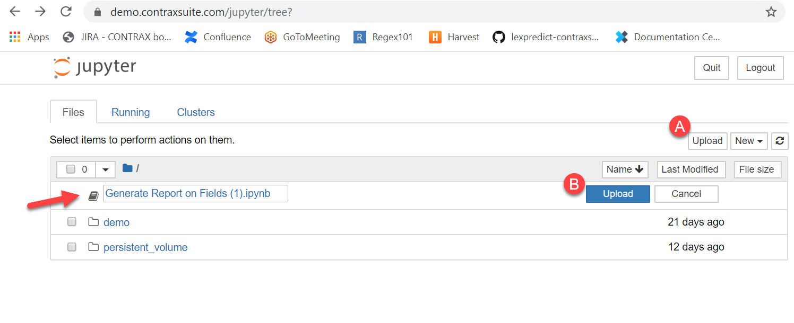

**3.** Once the Notebook is uploaded you will be able to locate it in the `persistent_volume` folder. Double-click on `persistent_volume`, then find the Notebook you're looking for in the list, and double-click on that name as well.

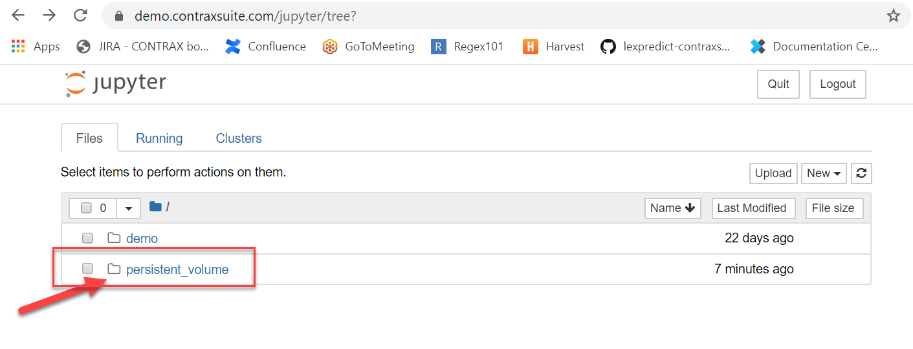

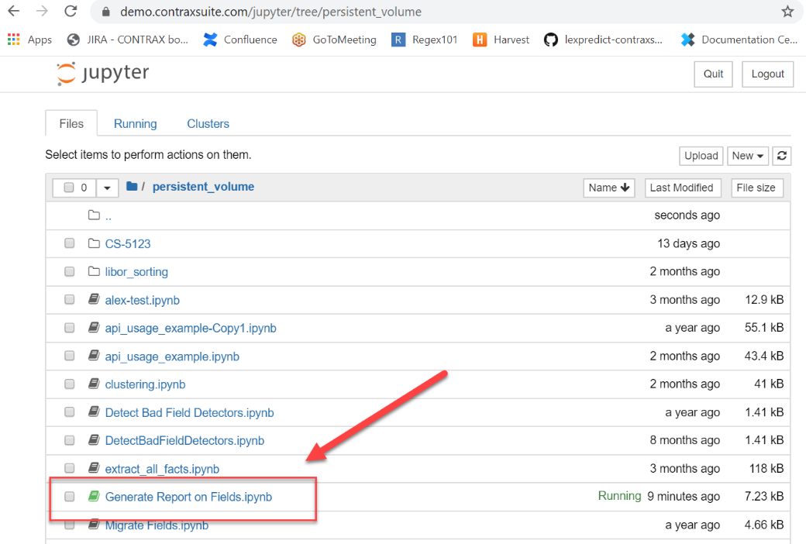

**4.** Many notebooks that use Django objects start out looking like the below image. The code in the red box below contains basic information about the Notebook.

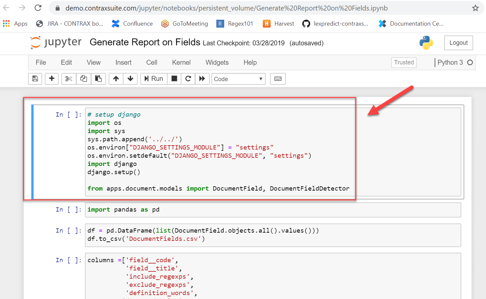

This is the first "cell" in the notebook. in the image, you'll notice that several subsequent cells follow it. You will need to update the `sys.path.append('../../')` line of this cell to reflect the folder you put the file in. If you are in a sub-folder of the Jupyter Notebook, then the above path would be correct. If you are 2 sub-folders deep, then you would need to change the line to `('../../../')`. If you put your file into the root Jupyter folder, then you will only need `('../')`. 

**5.** To run or apply this Notebook in ContraxSuite, first make sure the correct cell is highlighted. (In the image above you can see the referenced cell is highlighted by a thick blue line and surrounding grey outline.) Hit the "Run" button in the top menu bar. You will initially see a * in the brackets where you see "**In [ ]**" to the left of the cell. When the cell is done running, this * will be replaced by a number. In this case, you will now see the number 1 in the brackets after hitting "Run", and will also see some new text has been generated that provides context, as well as any warnings that occurred.

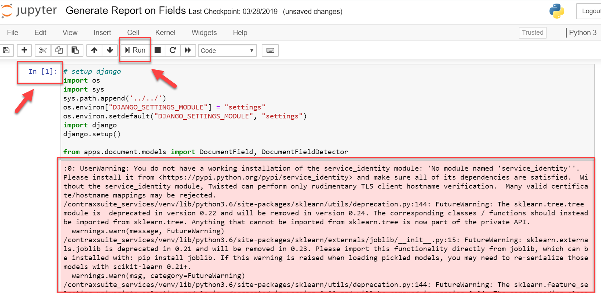

You will also see that the next cell in the sequence is now highlighted.

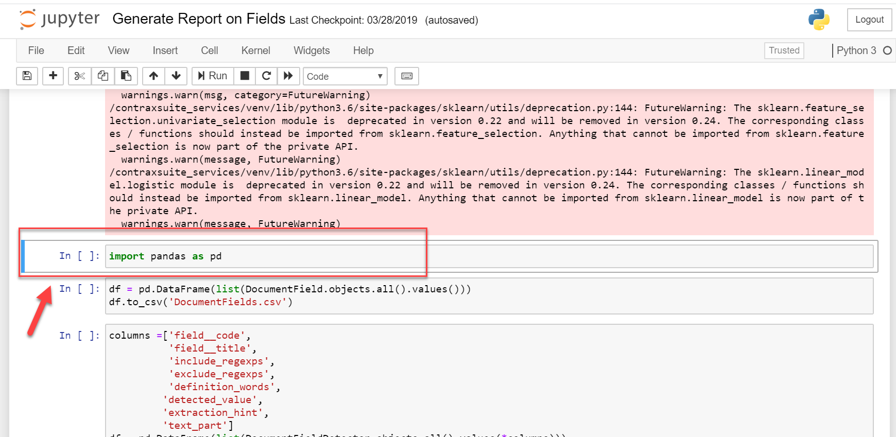

**6.** As you continue to run each subsequent cell, the [] will populate with a number, and the next cell will then be highlighted. You will need to hit "Run" on every cell manually, but before you run each cell, you should review output to determine if anything needs to be modified. In the example below, Cell 3 will create an output named `DocumentFields.csv`. You can change the name in the cell if you wish. More importantly, in the next cell there is a list of fields that will appear as columns in `DocumentFields.csv`. If you want your output to pull values from fields other than those listed in this cell, you can modify that cell before clicking "Run".

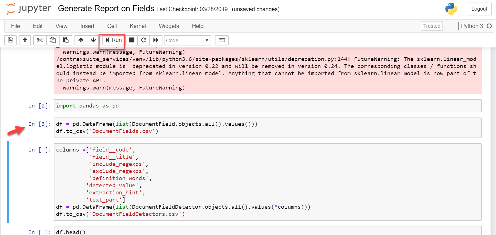

**7.** In the below example, "exclude_regexps" has been deleted from the list in Cell 4. The subsequent cell, Cell 5, was also run, resulting in a display of the selected outputs from `DocumentFields.csv`. Note that "exclude_regexps" is not a column header in the csv file.

**8.** When you have run all the cells you will see a blank cell with no content appear as the next cell after the last.

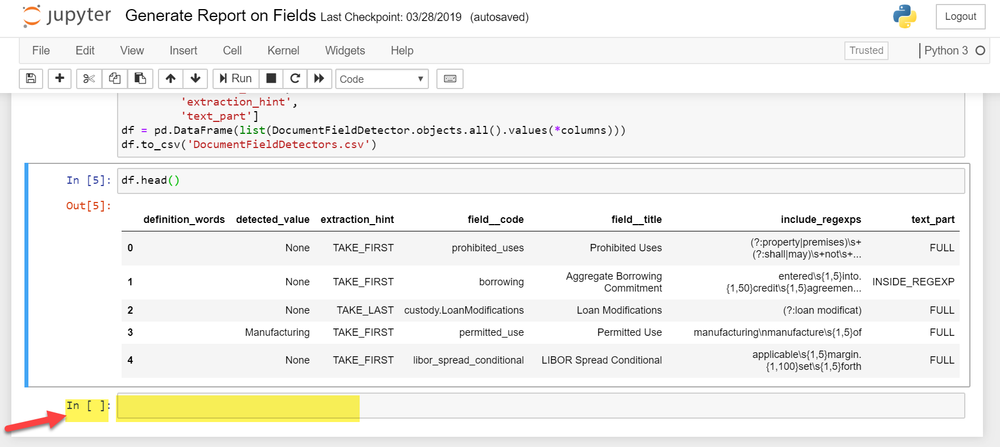

**9.** Depending on what actions the Jupyter Notebook executed, you can look in the system for any changes that were applied. In our example so far, the Jupyter Notebook was applied to run a report, pull information from the system, and create a `.csv` file. The line containing the code `to_csv` or `to_excel` will contain a file name, in our example, `DocumentFields.csv`. If there is a path specified, the file will be output to that path. If only a filename is provided, the file will be output to the same folder the code runs from.

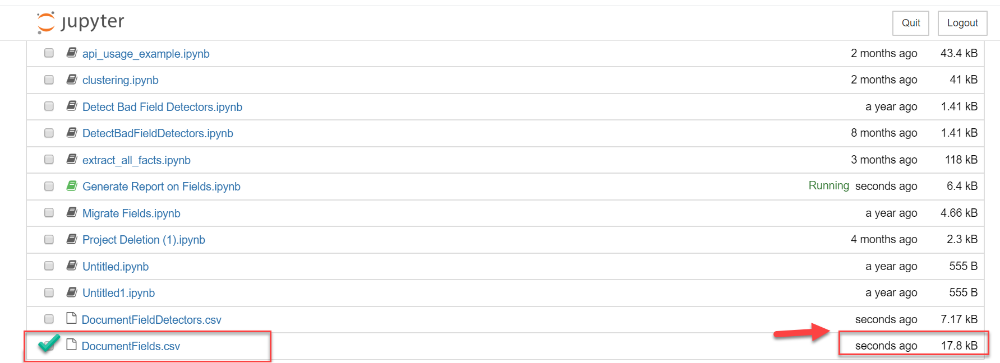

In this example, the report ran from the `persistent_volume` folder, so the output file will also be located in the `persistent_volume` folder. In addition, the output document, `DocumentFields.csv` has been created and correctly named, and appears in the list. Also you can note in the right hand column that the file was last modified only seconds ago, another useful hint.

**10.** Finally, to open the document, click on the box to the left of the document name and then click "Download" in the top menu.

   